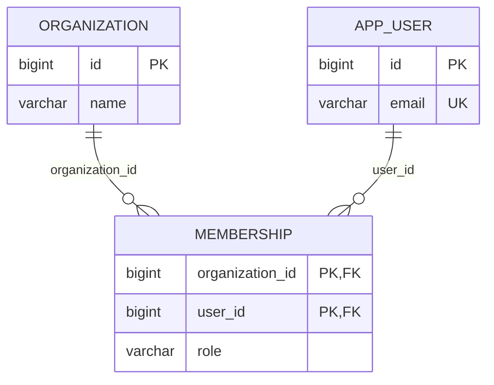

# Versioned ERD and image workflow

## Default artifacts

Keep existing project conventions when present. Otherwise use:

```text
docs/database/erd.md              Mermaid source, provenance, detailed schema notes
docs/database/diagrams/           optional derived SVGs and render manifest
<existing ORM/schema paths>      authoritative implementation inputs
<existing migration location>   the project's existing migration history
```

Mermaid fenced code in Markdown renders on [GitHub](https://docs.github.com/en/get-started/writing-on-github/working-with-advanced-formatting/creating-diagrams), so one text document supplies both a reviewable diff and a diagram. A separate `.mmd` is also supported when an existing exporter produces it; do not maintain two independently edited copies of the same diagram.

At the top of each ERD document, record its state (`proposed`, `code-target`, or `database-snapshot`), scope, engine/version, source paths and relevant revision, and extraction/review method. For a database snapshot, identify the environment and observation time without credentials or row data. List omissions or unverified mappings. A rendering check is not a semantic schema check.

Use feature-sized diagrams plus an overview for large schemas. Include a legend and exact names or explicit aliases. Keep renderer versions consistent when committing SVGs to reduce layout noise; review the text diff for meaning and the image for readability.

## Represent relationships faithfully

- Show physical table names and persisted columns for a physical ERD. Separate conceptual relations or ORM-only associations from enforced database foreign keys in labels/notes.
- Derive child-to-parent optionality from actual FK nullability. Derive a one-to-one maximum from a valid uniqueness constraint. A foreign key alone does not require every parent to have a child.
- Preserve junction tables, composite key membership, and both sides of their foreign keys. Do not flatten an implemented join table into a conceptual many-to-many line without noting the abstraction.
- Distinguish a composite unique key from independent uniqueness on each column. Record the constraint name and ordered members in notes. Check nullable composite-FK behavior under the selected engine and match mode before reducing it to a single optionality marker.
- Use Mermaid's identifying/non-identifying line style consistently and explain the convention. The line style does not replace a constraint definition.
- Mermaid type labels are descriptive, not SQL validation. Use supported labels and put exact engine types, precision, nullability, defaults, unique groups, index expressions/predicates, checks, and delete/update actions in an adjacent table when needed.

Prefer portable, established Mermaid syntax rather than assuming GitHub runs the latest renderer. See [Mermaid ERD syntax](https://mermaid.js.org/syntax/entityRelationshipDiagram.html).

## Illustrative example

This is a proposed teaching example, not a schema extracted from the user's application. It assumes a composite membership primary key and enforced, non-null foreign keys. A user or organization can have zero memberships; each membership belongs to exactly one of each.



Here `MEMBERSHIP` has one primary key on `(organization_id, user_id)`, not two independent primary keys. The illustrative `APP_USER.email` uniqueness rule still needs the chosen engine's nullability and comparison semantics defined before implementation. Delete actions and physical string lengths are intentionally unspecified, so this diagram alone cannot generate a complete migration.

## Optional local SVG export

Resolve `skill_root` to the `design-database` folder. Python 3.9+ is required. Use the project's installed/pinned Mermaid CLI when available:

```bash
python3 "$skill_root/scripts/render_erd.py" docs/database/erd.md \
  --output-dir docs/database/diagrams \
  --renderer './node_modules/.bin/mmdc'
```

For an environment without a local CLI, a pinned temporary npm runner can be used without adding a runtime dependency to the application:

```bash
python3 "$skill_root/scripts/render_erd.py" docs/database/erd.md \
  --output-dir docs/database/diagrams \
  --renderer 'npx --yes --package=@mermaid-js/mermaid-cli@12.0.0 mmdc'
```

That CLI release requires a compatible Node runtime and a Puppeteer browser. Use `--puppeteer-config /local/path/config.json` to select an existing browser if needed; keep machine-specific paths outside committed project files. Follow [Mermaid CLI](https://github.com/mermaid-js/mermaid-cli) when using another version. GitHub's inline diagram does not require this local export step.

The helper exports each plain `erDiagram` block as `erd-1.svg`, `erd-2.svg`, etc. into a directory dedicated to that document. It supports backtick/tilde fences and bare `.mmd` ERDs; diagram-level YAML frontmatter is not supported by its extractor. It stages every render before replacing managed images, protects unrelated files, and records source/image hashes and renderer version in `erd-render.json`. This manifest is rendering provenance, not another database schema or migration history.

Check committed exports without launching a browser:

```bash
python3 "$skill_root/scripts/render_erd.py" docs/database/erd.md \
  --output-dir docs/database/diagrams --check
```

This detects changed Markdown, missing/edited SVGs, or a mismatched image set. It does **not** compare ORM models, migrations, or live database state. Perform that comparison through the design/review workflow before regenerating documentation. Do not present a passing image check as proof that the database matches the diagram.

Inspect exported SVGs for legibility, clipping, relationship labels, and cardinalities before delivery. Add source documentation and any chosen derived images to the same change as the corresponding implementation. Publish or push only within the user's requested scope.
